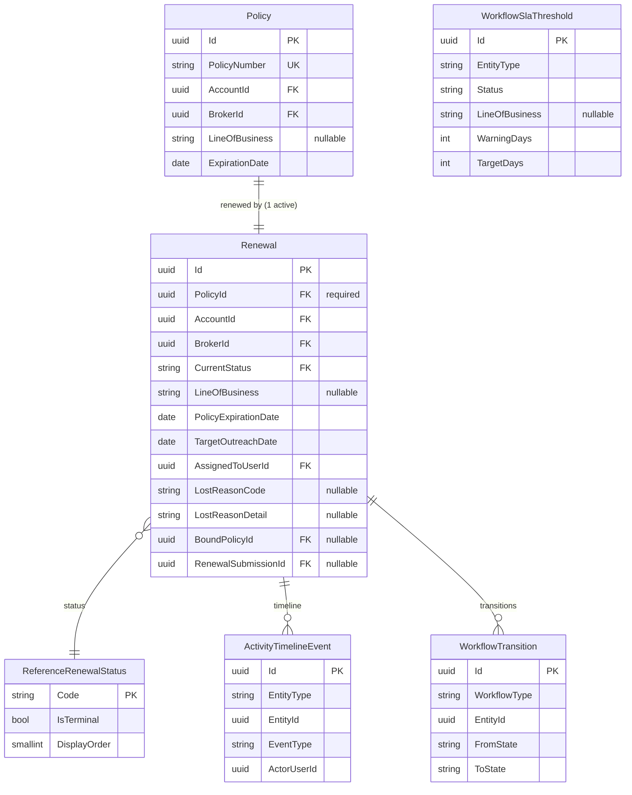
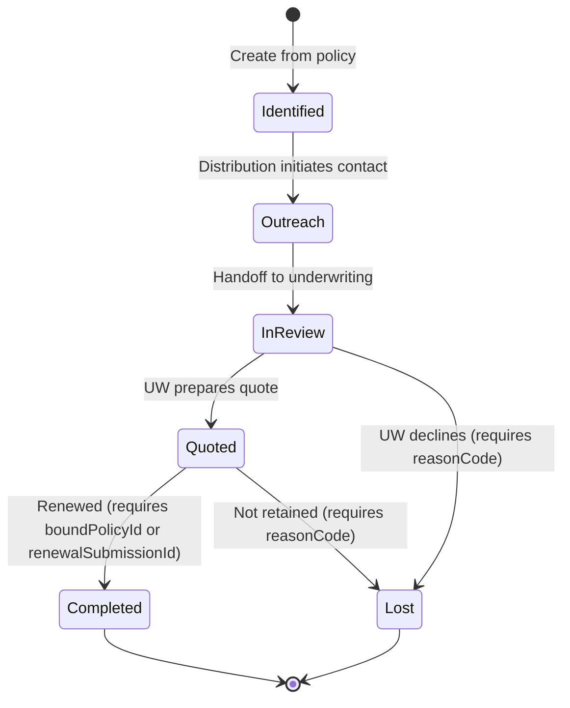

# F0007 — Renewal Pipeline

**Status:** Done (Archived)
**Priority:** Critical
**Phase:** CRM Release MVP
**Archived:** 2026-04-12

## Overview

Track upcoming renewals with proactive workflow stages, ownership, and timing visibility so teams can start outreach early and avoid last-minute renewal chaos. Renewals are created from expiring policies and tracked through Identified → Outreach → InReview → Quoted → Completed/Lost with configurable per-LOB timing windows.

## Documents

| Document | Purpose |
|----------|---------|
| [PRD.md](./PRD.md) | Product scope, personas, workflows, screens, and business rules |
| [STATUS.md](./STATUS.md) | Planning and implementation tracker |
| [GETTING-STARTED.md](./GETTING-STARTED.md) | Prerequisites, dependencies, and verification steps |

## Stories

| ID | Title | Priority | Status |
|----|-------|----------|--------|
| [F0007-S0001](./F0007-S0001-renewal-pipeline-list-with-due-window-filtering.md) | Renewal pipeline list with due-window filtering | Critical | Done |
| [F0007-S0002](./F0007-S0002-renewal-detail-view-with-policy-context.md) | Renewal detail view with policy context and outreach history | Critical | Done |
| [F0007-S0003](./F0007-S0003-renewal-status-transitions.md) | Renewal status transitions | Critical | Done |
| [F0007-S0004](./F0007-S0004-renewal-ownership-assignment-and-handoff.md) | Renewal ownership assignment and handoff | High | Done |
| [F0007-S0005](./F0007-S0005-overdue-renewal-visibility-and-escalation-flags.md) | Overdue renewal visibility and escalation flags | High | Done |
| [F0007-S0006](./F0007-S0006-create-renewal-from-expiring-policy.md) | Create renewal from expiring policy | Critical | Done |
| [F0007-S0007](./F0007-S0007-renewal-activity-timeline-and-audit-trail.md) | Renewal activity timeline and audit trail | High | Done |

**Total Stories:** 7
**Completed:** 7 / 7

---

## Architecture Specification (Phase B)

**Architect Review Date:** 2026-03-26
**ADRs:** ADR-010 (Temporal — Accepted), ADR-011 (State Machines — Accepted), ADR-014 (WorkflowSlaThreshold Per-LOB Extension — Accepted)

### Feature ERD



### Feature ERD (ASCII)

```
F0007 RENEWAL PIPELINE — ENTITY MODEL

  Policy ──────────┐
   (F0018 stub)    │ PolicyId (req, 1 active per policy)
                   ▼
  Renewal ─────────────────────────────────────────────────────
   │ PolicyExpirationDate, TargetOutreachDate, LineOfBusiness
   │ LostReasonCode/Detail (Lost), BoundPolicyId/RenewalSubmissionId (Completed)
   │
   ├─FK (req) → Account (inherited from Policy at creation)
   ├─FK (req) → Broker  (inherited from Policy at creation)
   ├─FK (req) → UserProfile (AssignedToUserId)
   ├─FK (opt) → Policy (BoundPolicyId — Completed outcome)
   ├─FK (opt) → Submission (RenewalSubmissionId — Completed outcome)
   ├─FK       → ReferenceRenewalStatus (CurrentStatus)
   │
   ├──► ActivityTimelineEvent (EntityType=Renewal, EntityId=Renewal.Id)
   └──► WorkflowTransition    (WorkflowType=Renewal, EntityId=Renewal.Id)

  WorkflowSlaThreshold
   └─ (EntityType=renewal, Status=Identified, LineOfBusiness=nullable)
      → TargetDays = outreach target (days before expiry)
      → WarningDays = approaching buffer (additional days before target)
```

### Workflow State Machine

#### State Diagram



#### Transition Matrix

| From | To | Allowed Actors | Guard Conditions | Side Effects |
|------|----|----------------|------------------|--------------|
| (null) | Identified | DistributionUser, DistributionManager, Admin | PolicyId valid, no active renewal for policy, region alignment | WorkflowTransition(null→Identified), ActivityTimelineEvent(RenewalCreated), TargetOutreachDate computed |
| Identified | Outreach | DistributionUser, DistributionManager, Admin | — | WorkflowTransition, ActivityTimelineEvent(RenewalTransitioned) |
| Outreach | InReview | DistributionUser, DistributionManager, Underwriter, Admin | — | WorkflowTransition, ActivityTimelineEvent(RenewalTransitioned). Represents handoff to underwriting. |
| InReview | Quoted | Underwriter, Admin | — | WorkflowTransition, ActivityTimelineEvent(RenewalTransitioned) |
| InReview | Lost | Underwriter, Admin | `reasonCode` required; `reasonDetail` required if `reasonCode=Other` | WorkflowTransition(reason=reasonCode), ActivityTimelineEvent(RenewalTransitioned), LostReasonCode/Detail set |
| Quoted | Completed | Underwriter, Admin | `boundPolicyId` OR `renewalSubmissionId` required | WorkflowTransition, ActivityTimelineEvent(RenewalTransitioned), BoundPolicyId/RenewalSubmissionId set |
| Quoted | Lost | Underwriter, Admin | `reasonCode` required; `reasonDetail` required if `reasonCode=Other` | WorkflowTransition(reason=reasonCode), ActivityTimelineEvent(RenewalTransitioned), LostReasonCode/Detail set |

#### Lost Reason Codes

Validated at API layer (not DB enum):

| Code | Description |
|------|-------------|
| NonRenewal | Carrier or insured chose not to renew |
| CompetitiveLoss | Account moved to another broker/carrier |
| BusinessClosed | Insured business no longer operating |
| CoverageNoLongerNeeded | Insured no longer requires this coverage |
| PricingDeclined | Quote terms unacceptable to insured |
| Other | Free-text reason required in `reasonDetail` |

#### Error Responses

| Condition | HTTP | Error Code |
|-----------|------|------------|
| Invalid transition pair | 409 | `invalid_transition` |
| Missing required prerequisite (reasonCode, boundPolicyId) | 409 | `missing_transition_prerequisite` |
| User lacks role for transition | 403 | `policy_denied` |
| Duplicate active renewal for policy | 409 | `duplicate_renewal` |
| Region mismatch on creation | 400 | `region_mismatch` |
| Concurrency conflict | 409 | `concurrency_conflict` |
| Policy/renewal not found or deleted | 404 | `not_found` |
| Assignment to terminal-state renewal | 409 | `invalid_transition` |

### Overdue and Approaching Detection

Computed at query time from `PolicyExpirationDate`, `TargetOutreachDate`, `CurrentStatus`, and `WorkflowSlaThreshold` entries. No persisted overdue flag — it's a derived field on the API response.

**Computation (server-side, returned in list/detail response):**

```
For each renewal where CurrentStatus = 'Identified':
  1. Look up WorkflowSlaThreshold where EntityType='renewal', Status='Identified',
     LineOfBusiness = renewal.LineOfBusiness (fallback to NULL/default entry)
  2. overdueDate = PolicyExpirationDate - TargetDays
  3. approachingDate = PolicyExpirationDate - TargetDays - WarningDays
  4. If current_date > overdueDate → urgency = "overdue"
     Else if current_date > approachingDate → urgency = "approaching"
     Else → urgency = null (on track)

For renewals past Identified (Outreach, InReview, Quoted) → urgency = null
For terminal renewals (Completed, Lost) → urgency = null
```

### Temporal Workflow Design (Future Phase)

Per ADR-010, Temporal is adopted for durable long-running CRM workflows. For F0007 MVP, overdue/approaching detection is **query-time computation** — no Temporal workflows are required. The Temporal design below documents the planned architecture for the next phase (automated reminders and escalation).

#### Planned Workflow: `RenewalReminderWorkflow`

**Trigger:** Created when a renewal enters `Identified` state.
**Workflow ID convention:** `renewal-reminder-{renewalId}`
**Task Queue:** `renewal-reminders`

**Signal interface:**
- `RenewalAdvanced(toState)` — signals that the renewal has moved past Identified; workflow terminates.
- `RenewalCancelled` — signals that the renewal has been deleted; workflow terminates.

**Query interface:**
- `GetNextReminderDate()` — returns the next scheduled reminder timestamp.

**Activities (idempotent):**
- `SendApproachingNotification(renewalId)` — creates a Task linked to the renewal and/or sends a notification.
- `SendOverdueNotification(renewalId, escalationLevel)` — creates an escalation Task for the manager and/or sends a notification.
- `RecordEscalationEvent(renewalId, level)` — appends an ActivityTimelineEvent recording the automated escalation.

**Workflow logic:**
```
1. Sleep until approachingDate
2. Execute SendApproachingNotification (idempotent)
3. Sleep until overdueDate
4. Execute SendOverdueNotification (level=1, idempotent)
5. Sleep 7 days
6. Execute SendOverdueNotification (level=2, idempotent)
7. Repeat escalation at increasing intervals until renewal advances or terminal

At any point: if RenewalAdvanced or RenewalCancelled signal received, terminate.
```

**Idempotency:** Each activity checks whether a matching Task/Event already exists for the same renewal and escalation level before creating a new one. Retries are safe.

**Correlation:** `Renewal.TemporalWorkflowId` (nullable varchar(100)) stores the workflow ID for status queries and cancellation. This field is added to the Renewal entity in the Temporal phase, not in MVP.
