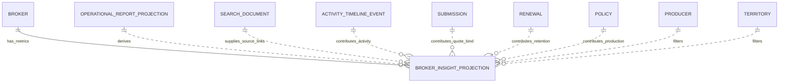

# F0008 — Broker Insights

**Status:** Done - Archived
**Archived:** 2026-07-03
**Priority:** High
**Phase:** MVP

## Overview

Provide broker performance, relationship, and production insights so distribution leaders can focus on the right brokers and act on trends instead of assembling reports manually.

## Documents

| Document | Purpose |
|----------|---------|
| [PRD.md](./PRD.md) | Product scope and business outcomes |
| [STATUS.md](./STATUS.md) | Planning and implementation tracker |
| [GETTING-STARTED.md](./GETTING-STARTED.md) | Setup and refinement notes |

## Stories

| ID | Title | Status |
|----|-------|--------|
| [F0008-S0001](./F0008-S0001-broker-scorecard-overview.md) | Broker scorecard overview | Complete |
| [F0008-S0002](./F0008-S0002-trend-drilldown-source-records.md) | Trend drilldown and source record navigation | Complete |
| [F0008-S0003](./F0008-S0003-authorized-benchmark-comparison.md) | Authorized benchmark comparison | Complete |
| [F0008-S0004](./F0008-S0004-review-snapshot.md) | Broker review snapshot | Complete |
| [F0008-S0005](./F0008-S0005-permission-safe-insights.md) | Permission-safe broker insight behavior | Complete |

**Total Stories:** 5
**Completed:** 5 / 5

## Architecture

- Decision: [ADR-031 Broker Insights Read Models and Permission-Safe Analytics](../../architecture/decisions/ADR-031-broker-insights-read-models.md)
- API: `planning-mds/api/nebula-api.yaml` (`BrokerInsights` tag)
- Schemas: `planning-mds/schemas/broker-insight-*.schema.json`
- Data model: `planning-mds/architecture/data-model.md` §12
- Authorization: `broker_insight:read`, internal-only, query-layer source filtering

### ERD



```text
Broker
  -> BrokerInsightProjection (read-only facts by broker / period / metric)
       <- OperationalReportProjection, SearchDocument, ActivityTimelineEvent
       <- Submission, Renewal, Policy source outcomes
       <- Producer / Territory / Program dimensions
```

### C4 Component View

```text
[Broker Insights Workspace]
        |
        v
[BrokerInsightsEndpoints] -- broker_insight:read --> [Casbin/AuthZ]
        |
        v
[BrokerInsightService]
        |
        +--> [ProjectionVisibilityResolver / source auth filters]
        +--> [BrokerInsightProjection repository or view]
        +--> [F0023 SearchDocument / OperationalReportProjection]
        +--> [Source detail routes for drilldown]
```
