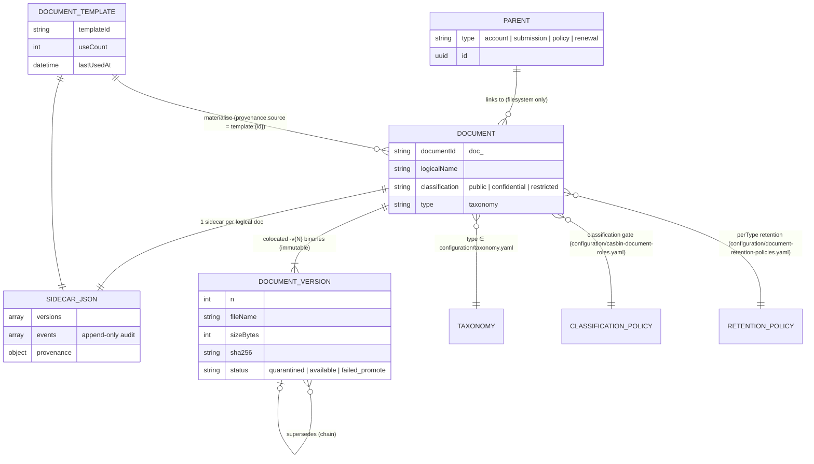

# F0020 — Document Management & ACORD Intake

**Status:** Done
**Priority:** Critical
**Phase:** CRM Release MVP
**Archived:** 2026-05-05

## Overview

Provide the shared Nebula document subsystem: single + bulk upload, quarantine + mock-scan promote pipeline, immutable colocated versioning, type-specific sidecar JSON metadata with a lightweight schema registry, classification-based access control, soft completeness signal, retention policy YAML, and a templates library — covering ACORD forms, loss runs, financials, quotes, endorsements, policies, and broker boilerplates.

## Documents

| Document | Purpose |
|----------|---------|
| [PRD.md](./PRD.md) | Product scope, ASCII screen layouts, and business outcomes |
| [STATUS.md](./STATUS.md) | Planning and implementation tracker |
| [GETTING-STARTED.md](./GETTING-STARTED.md) | Setup and refinement notes |

## Stories

| ID | Title | Status |
|----|-------|--------|
| [F0020-S0001](./F0020-S0001-upload-single-document-with-metadata.md) | Upload single document with metadata to a parent record | Done |
| [F0020-S0002](./F0020-S0002-bulk-multi-file-upload.md) | Bulk multi-file upload to a parent record | Done |
| [F0020-S0003](./F0020-S0003-quarantine-and-mock-scan-workflow.md) | Quarantine and mock-scan workflow | Done |
| [F0020-S0004](./F0020-S0004-list-documents-with-classification-filtering.md) | List documents on a parent record with classification filtering | Done |
| [F0020-S0005](./F0020-S0005-document-detail-with-preview-and-provenance.md) | Document detail view with preview and provenance | Done |
| [F0020-S0006](./F0020-S0006-download-current-and-prior-versions.md) | Download a document for current and prior versions | Done |
| [F0020-S0007](./F0020-S0007-replace-with-immutable-supersedes-lineage.md) | Replace a document with immutable supersedes lineage | Done |
| [F0020-S0008](./F0020-S0008-update-metadata-without-new-version.md) | Update document metadata without creating a new binary version | Done |
| [F0020-S0009](./F0020-S0009-classification-based-access-control.md) | Classification-based access control on document operations | Done |
| [F0020-S0010](./F0020-S0010-document-completeness-signal-endpoint.md) | Document completeness signal endpoint | Done |
| [F0020-S0011](./F0020-S0011-retention-policy-yaml-and-scheduled-cleanup.md) | Retention policy YAML and scheduled cleanup | Done |
| [F0020-S0012](./F0020-S0012-document-templates-library.md) | Document templates library | Done |

**Total Stories:** 12
**Completed:** 12 / 12

## Architecture Review (Phase B — 2026-05-04)

**Phase B status:** Complete
**Execution Plan:** `feature-assembly-plan.md` (created during the next `feature` action — not a `plan` deliverable)

### Key Findings

- ADR-012 finalised from Proposed → Accepted with the user-clarified contract: on-disk repository at `<docroot>` with reserved `configuration/` folder for canonical YAML, sidecar JSON metadata colocated with binaries (single sidecar per logical document), immutable colocated versioning via `-v{N}` suffix, classification + ABAC layered model.
- ADR-019 created to record the **mock-quarantine-then-promote** ingest pipeline as an explicit, testable contract. The 60-second hold is a structural placeholder; replacing the timer with a real malware scanner is a single-interface swap (`IQuarantineScanner`).
- Document persistence is **filesystem-first** in MVP — no relational `Document` table. Storage is abstracted behind `IDocumentRepository` so a future migration to object storage (S3, Azure Blob) is a backend swap without breaking feature contracts.
- Audit dual-record: every document operation produces a sidecar JSON `events[]` row (granular, append-only, fsync) **and** an `ActivityTimelineEvent` (cross-feature feed) per SOLUTION-PATTERNS §2.
- Retention is YAML-driven with a hard 10-day MVP ceiling. Production retention is explicitly Future scope; the loader rejects values above the ceiling so MVP can never silently retain too long.
- Classification policy lives in `<docroot>/configuration/casbin-document-roles.yaml`; runtime evaluator is closed-by-default and hot-reloads within 60 s. The combined gate is `parent_abac ∧ classification_policy`.

### Architecture Artifacts

| Artifact | Status |
|----------|--------|
| Data model / ERD | See ASCII ERD below — filesystem-first; no relational entity in MVP. |
| API contract (OpenAPI) | Updated — `planning-mds/api/nebula-api.yaml` adds `Documents` and `DocumentTemplates` tags and 8 paths. |
| Workflow state machine | Added — `workflow:document-ingest` with states `quarantined → available | failed_promote`. |
| Casbin policy | Updated — `planning-mds/security/policies/policy.csv` §3 adds 70 document/template rows; `authorization-matrix.md` §4 adds the combined-gate matrix. |
| JSON schemas | Added — `document-sidecar`, `document-metadata-schema-registry`, `document-list-item`, `paginated-document-list`, `document-detail`, `document-completeness`, `document-retention-policy`, `document-classification-policy`, `document-template` (9 files in `planning-mds/schemas/`). |
| C4 diagrams | See ASCII C4 component diagram below. |
| ADRs | ADR-012 finalised (Accepted); ADR-019 created (Accepted). |
| Assembly plan | Out of scope for `plan` action — produced by the next `feature` action's Step 0. |

### Feature ERD (ASCII; filesystem-first)

The MVP shape is on-disk, not relational. The "ERD" below is the file-system layout that backs the conceptual model.

```text
              <docroot>/
                │
                ├── configuration/                        ◄ canonical YAML (taxonomy, retention, classification policy)
                │     ├── taxonomy.yaml
                │     ├── document-retention-policies.yaml
                │     ├── casbin-document-roles.yaml
                │     ├── metadata-schemas/registry.yaml    ◄ versioned type-specific JSON metadata schemas
                │     └── retention-sweeps.jsonl          ◄ append-only sweep audit
                │
                ├── quarantine/                           ◄ holds binaries during the 60s scanner mock
                │     └── {upload-id}                     ◄ deleted after promote
                │
                ├── templates/
                │     └── {templateId}/
                │            ├── {logical}-v{N}.{ext}     ◄ colocated template versions (immutable)
                │            └── {logical}.json           ◄ ONE sidecar JSON per template (incl. useCount, lastUsedAt)
                │
                └── {parent-type}/                        ◄ account | submission | policy | renewal
                       └── {parent-id}/
                              ├── {logical}-v1.{ext}      ◄ document version 1
                              ├── {logical}-v2.{ext}      ◄ document version 2 (supersedes v1; v1 still on disk)
                              ├── …                       ◄ per ADR-012, prior binaries are NEVER overwritten
                              └── {logical}.json          ◄ ONE sidecar JSON for ALL versions of {logical}

              Sidecar JSON (`document-sidecar.schema.json`):
                  documentId   (ULID; doc_…)
                  logicalName  (basename, no version suffix)
                  parent       { type, id }
                  classification ∈ { public, confidential, restricted }
                  type           (taxonomy entry)
                  versions[]   { n, fileName, sizeBytes, sha256, status, uploadedAt, uploadedByUserId, supersedes? }
                  events[]     append-only audit (uploaded, promoted, replaced, classified, downloaded, swept, …)
                  provenance   { source: upload | template:{id}, materializedAt?, byUserId? }
```



### C4 Component Diagram (ASCII)

```text
┌──────────────────────────── Engine (.NET) ─────────────────────────────────────────┐
│                                                                                    │
│  API Layer (controllers / minimal API)                                             │
│   ├─ DocumentsController         POST/GET/PUT/PATCH /documents…                    │
│   └─ DocumentTemplatesController GET/POST /document-templates…                     │
│            │                                                                       │
│            ▼                                                                       │
│  Application Layer                                                                 │
│   ├─ DocumentService            (upload, replace, edit metadata, completeness)     │
│   ├─ DocumentTemplateService    (template CRUD + materialise)                      │
│   ├─ IQuarantineScanner ◄──── MockTimerScanner (MVP)                               │
│   ├─ DocumentClassificationGate (parent ABAC ∧ classification policy)              │
│   └─ DocumentRetentionService   (sweep + JSONL audit)                              │
│            │                                                                       │
│            ▼                                                                       │
│  Domain Layer                                                                      │
│   ├─ Document, DocumentVersion, SidecarJson value objects                          │
│   ├─ DocumentTemplate value object                                                 │
│   └─ DocumentIngest state machine (quarantined → available | failed_promote)       │
│            │                                                                       │
│            ▼                                                                       │
│  Infrastructure Layer                                                              │
│   ├─ IDocumentRepository ◄──── LocalFileSystemDocumentRepository (MVP)             │
│   ├─ ConfigurationLoaders (taxonomy, retention, classification)                    │
│   └─ QuarantineWorker (hosted service; 10s tick)                                   │
│                                                                                    │
└────────────────────────────────────────────────────────────────────────────────────┘
                                          │
                                          ▼
                         Filesystem  <docroot>/  (see ERD above)

┌──────────── Experience (React + Vite) ─────────────┐
│  Pages                                             │
│   ├─ DocumentsListPage   (per parent record)       │
│   ├─ DocumentDetailPage  (preview + history)       │
│   ├─ UploadDialog        (drag/drop, bulk)         │
│   └─ TemplatesLibrary                              │
│  Hooks (TanStack Query) — useDocuments, useUpload  │
│  Validation: AJV + JSON Schemas (shared)           │
└────────────────────────────────────────────────────┘
```

### NFR summary

| Concern | Target |
|---------|--------|
| List p95 (≤10 docs) | ≤ 500 ms |
| Detail render | ≤ 1.5 s on dev laptop (excl. preview render) |
| Download time-to-first-byte (5 MB) | ≤ 1 s |
| Upload handler (5 MB after byte receipt) | ≤ 1 s |
| Quarantine hold | 60 s (bounds 30-300 s) |
| Combined-gate evaluation | ≤ 5 ms p95 |
| Retention sweep (1k docs) | ≤ 30 s |
| Classification policy hot reload | ≤ 60 s |
