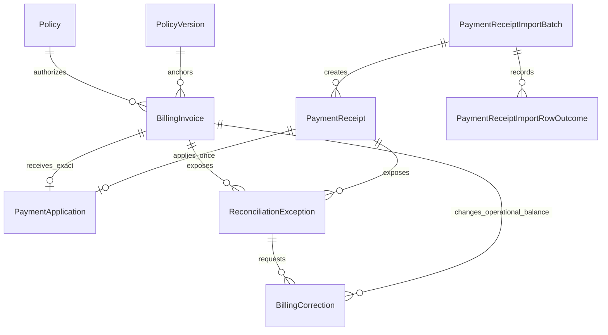

# F0026 — Billing, Invoicing & Reconciliation

**Status:** Done and archived
**Archived:** 2026-07-19
**Priority:** Medium
**Phase:** Brokerage Platform Expansion

## Overview

Provide an internal agency-bill workflow for policy-linked invoices, manual/CSV mock-vendor receipts, exact reconciliation, controlled correction approval, and backlog visibility. Real bank connectivity, direct bill, tolerance matching, write-offs, and accounting remain out of scope.

## Documents

| Document | Purpose |
|----------|---------|
| [PRD.md](./PRD.md) | Approved-boundary product requirements and screen/workflow contract |
| [acceptance-criteria-checklist.md](./acceptance-criteria-checklist.md) | Phase A story-quality checklist |
| [STATUS.md](./STATUS.md) | Planning and implementation tracker |
| [GETTING-STARTED.md](./GETTING-STARTED.md) | Scope, dependencies, and later verification entry points |
| [feature-assembly-plan.md](./feature-assembly-plan.md) | Architect-owned implementation order, file map, contracts, and checks |
| [ADR-034](../../architecture/decisions/ADR-034-agency-bill-invoicing-and-exact-reconciliation.md) | Agency-bill module, exact application, correction, authorization, and mock-adapter decision |
| [Finance personas](../../examples/personas/finance-operations-personas.md) | Finance Operations Analyst and Finance Manager archetypes |

## Stories

| ID | Title | Status |
|----|-------|--------|
| [F0026-S0001](./F0026-S0001-billing-workspace-search-and-policy-context.md) | Billing workspace search and policy context | Done |
| [F0026-S0002](./F0026-S0002-create-agency-bill-invoice.md) | Create an agency-bill invoice | Done |
| [F0026-S0003](./F0026-S0003-record-payment-receipts.md) | Record manual and mock-vendor payment receipts | Done |
| [F0026-S0004](./F0026-S0004-apply-exact-payment-and-reconcile-invoice.md) | Apply an exact payment and reconcile an invoice | Done |
| [F0026-S0005](./F0026-S0005-review-exceptions-and-approve-corrections.md) | Review exceptions and approve correction adjustments | Done |
| [F0026-S0006](./F0026-S0006-monitor-reconciliation-backlog-and-audit.md) | Monitor reconciliation backlog and audit history | Done |

**Total Stories:** 6
**Completed:** 6 / 6

## Phase B Domain View

`BillingInvoice.OutstandingAmount` is an operational reconciliation value, not a ledger balance. Only an exact application or approved correction may change it.
