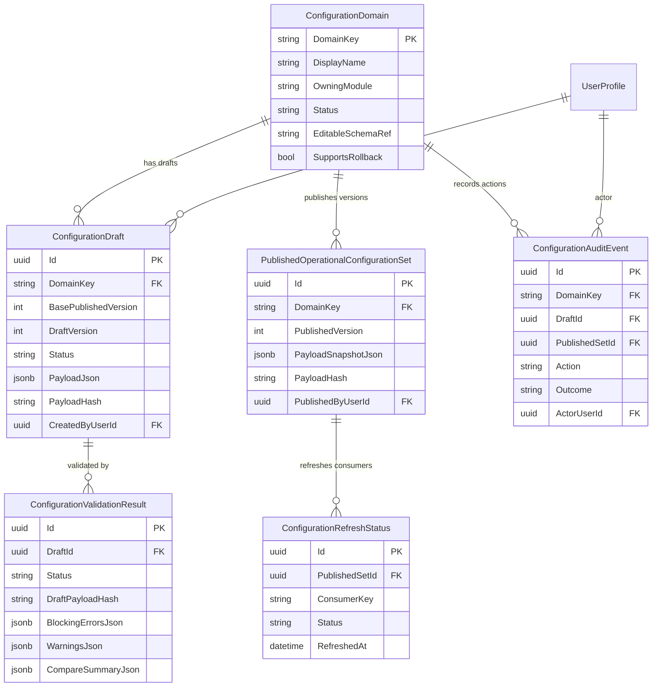

# F0032 Architecture: Admin Configuration & Reference Data Console

## Service Boundaries

F0032 is an admin configuration facade inside the existing modular monolith.

| Layer | Responsibility |
|-------|----------------|
| API | `/admin/configuration-*` endpoints, authentication, ProblemDetails, `If-Match`, request/response DTOs |
| Application | Configuration catalog, draft lifecycle, validation orchestration, compare generation, publish, rollback, audit queries |
| Domain | Configuration domain definitions, draft state rules, validation-result state rules, published-set invariants |
| Infrastructure | EF Core persistence, JSONB payload storage, module adapters, refresh-status updates, cache invalidation |
| Frontend | `experience/src/features/admin-configuration/*` catalog, detail, draft editor, compare drawer, publish/rollback confirmation, audit workspace |

F0032 consumes existing modules through typed adapters. It does not own queue execution, saved-view CRUD execution, report projection execution, document generation, or product schema authoring.

## Data Model



ASCII summary:

```text
ConfigurationDomain
  -> ConfigurationDraft
       -> ConfigurationValidationResult
  -> PublishedOperationalConfigurationSet
       -> ConfigurationRefreshStatus
  -> ConfigurationAuditEvent
```

## API Contracts

OpenAPI contract additions live in `planning-mds/api/nebula-api.yaml` under the `AdminConfiguration` tag.

Primary endpoints:

| Endpoint | Purpose |
|----------|---------|
| `GET /admin/configuration-domains` | Catalog supported domains and current state |
| `GET /admin/configuration-domains/{domainKey}` | Domain detail with published, draft, validation, and refresh status |
| `POST /admin/configuration-domains/{domainKey}/drafts` | Create a draft from the current published version |
| `PATCH /admin/configuration-drafts/{draftId}` | Update draft payload with optimistic concurrency |
| `POST /admin/configuration-drafts/{draftId}/validation` | Validate the current draft payload |
| `GET /admin/configuration-drafts/{draftId}/comparison` | Compare draft against current published version |
| `POST /admin/configuration-drafts/{draftId}/publish` | Publish a validated draft |
| `POST /admin/configuration-domains/{domainKey}/rollback` | Publish an eligible previous version as rollback |
| `GET /admin/configuration-audit-events` | Permission-safe audit search |

## Authorization

All endpoints require authenticated internal users and server-side Casbin ABAC.

| Role / Subject | Resource | Actions |
|----------------|----------|---------|
| Admin | `admin_configuration` | `read`, `draft`, `validate`, `publish`, `rollback`, `audit` |
| ConfigurationSteward | `admin_configuration` | `read`, `draft`, `validate` |
| OperationsManager | `admin_configuration` | `read`, `validate` |
| ComplianceQualityLead | `admin_configuration` | `read`, `audit` |

Publish and rollback are Admin-only. Audit queries must redact draft payload fragments when the caller has audit access but lacks the domain-specific read policy for the underlying module.

## Workflow Rules

```text
DraftCreated
  -> DraftUpdated
  -> ValidationPassed
  -> Published

DraftCreated
  -> DraftUpdated
  -> ValidationFailed
  -> DraftUpdated

Published
  -> RollbackRequested
  -> Published
```

Rules:

- Draft payloads never affect runtime behavior.
- Publish requires the latest validation result to be `Passed` and to match the current draft `PayloadHash`.
- Publish is rejected with `409` if the draft base version is no longer the current published version.
- Update and archive-style draft mutations require `If-Match`; stale row versions return `412`.
- Rollback creates a new published version from an eligible prior snapshot and does not delete intervening audit events.
- Each mutation appends `ConfigurationAuditEvent` and `ActivityTimelineEvent`.

## Non-Functional Requirements

- Catalog and domain-detail reads: p95 under 500 ms for up to 25 configuration domains.
- Validation: p95 under 2 seconds for the first-release domains with up to 250 queue/routing rules or SLA rows per domain.
- Audit search: p95 under 750 ms for filtered first-page queries.
- Security: default deny, no payload or audit detail leakage on `403`/hidden domains.
- Frontend: use semantic theme tokens only; visual smoke coverage must include catalog, draft editor, compare drawer, and audit workspace in light and dark themes.

## Pattern Compliance

- Casbin ABAC per endpoint.
- ProblemDetails for every non-2xx response.
- JSON Schema contracts in `planning-mds/schemas/` drive request/response validation.
- Clean Architecture boundaries: source modules remain authoritative.
- Mutations emit append-only audit/timeline events.
- Cache strategy follows in-memory-first cache-aside with explicit refresh status.
